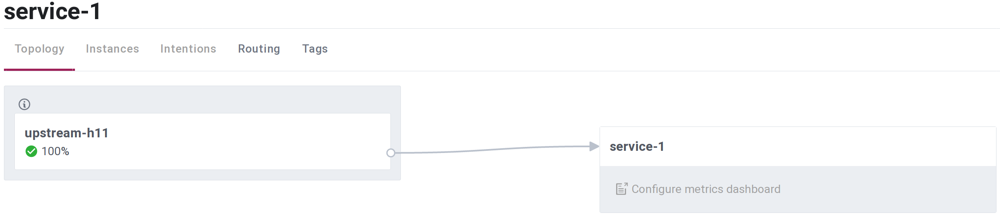

# MeshxRpc

<!-- MDOC !-->
RPC client and server.

`MeshxRpc` can be considered as an alternative to Erlang OTP [`:erpc`](https://erlang.org/doc/man/erpc.html) or [`:rpc`](https://erlang.org/doc/man/rpc.html) modules.

Major differences between `MeshxRpc` and native `:erpc` modules:
* `MeshxRpc` is using custom binary communication protocol, hence it doesn't depend on Erlang distribution and can be used with any user provided TCP transport solution, especially service mesh data plane,
* `MeshxRpc` restricts incoming request function executability scope to single module associated with given RPC server. This way user has full control over RPC server functionality exposed to remote RPC clients, instead of allowing unrestricted access to remote as it is a case for OTP `:erpc` module.

`MeshxRpc` features:
  * connection pooling,
  * user customizable serialization functions,
  * traffic chunking into smaller blocks of configurable maximum size to avoid IO socket blocking,
  * optional transmission error detection with user configurable asynchronously executed message block checksum functions,
  * reach per request telemetry metrics,
  * request integrity protection with sequence numbers and node/connection references,
  * primitive access control with optional preshared keys,
  * load balancing and high availability provided by service mesh data plane,
  * ability to run multiple RPC servers and/or clients on a single node.

`MeshxRpc` is designed to work primarily as mesh service and doesn't offer data encryption, authorization or authentication mechanisms as those are natively provided by service mesh environment.

## Installation
Add `:meshx_rpc` and optionally `:meshx_consul`, `:ranch` and `:poolboy` to application dependencies:
```elixir
# mix.exs
def deps do
  [
    {:meshx_rpc, "~> 0.1.0-dev", github: "andrzej-mag/meshx_rpc"},
    # if using :meshx_consul service mesh adapter add:
    {:meshx_consul, "~> 0.1.0-dev", github: "andrzej-mag/meshx_consul"},
    # if running RPC client(s) add:
    {:poolboy, "~> 1.5"},
    # if running RPC server(s) add:
    {:ranch, "~> 2.0"}
  ]
end
```

## Usage
Same `mix` project is used to implement both RPC server and RPC client to simplify examples.

Server and client nodes are started using custom command line argument `rpc_server?`:
  * start server: `iex --erl "-rpc_server? true"`,
  * start client: `iex --erl "-rpc_server? false"`.

### Example 1. Shared Unix Domain Socket.
Implement RPC server `Example1.Server` and client `Example1.Client` modules:
```elixir
# lib/server.ex
defmodule Example1.Server do
  use MeshxRpc.Server,
    address: {:uds, "/tmp/meshx.sock"},
    telemetry_prefix: [:example1, __MODULE__]

  def echo(args), do: args
  def ping(_args), do: :pong
end

# lib/client.ex
defmodule Example1.Client do
  use MeshxRpc.Client,
    address: {:uds, "/tmp/meshx.sock"},
    telemetry_prefix: [:example1, __MODULE__],
    pool_opts: [size: 1, max_overflow: 0]

  def echo(args), do: call(:echo, args)
end
```
Both client and server connect to the same UDS socket at `"/tmp/meshx.sock"`.
For RPC client number of pool workers is limited to one, to reduce amount of telemetry events logged to terminal.

RPC client and server are started using application supervision tree by using their respective child specifications `Example1.Client.child_spec()` and `Example1.Server.child_spec()`:
```elixir
# lib/example1/application.ex
defmodule Example1.Application do
  use Application

  @impl true
  def start(_type, _args) do
    children =
      if rpc_server?() do
        MeshxRpc.attach_telemetry([:example1, Example1.Server])
        [Example1.Server.child_spec()]
      else
        MeshxRpc.attach_telemetry([:example1, Example1.Client])
        [Example1.Client.child_spec()]
      end

    Supervisor.start_link(children, strategy: :one_for_one, name: Example1.Supervisor)
  end

  defp rpc_server?() do
    case :init.get_argument(:rpc_server?) do
      {:ok, [['true']]} -> true
      _ -> false
    end
  end
end
```

Launch two terminals, start RPC server node in first terminal:
```sh
iex --erl "-start_epmd false" --erl "-rpc_server? true" -S mix
```
Start RPC client node in second terminal:
```sh
iex --erl "-start_epmd false" --erl "-rpc_server? false" -S mix
```
In both terminals similar telemetry event should be logged, here client side:
```elixir
# [:example1, Example1.Client, :hsk] -> :ok
# local: %{conn_ref: "VPRihQ", node_ref: "nonode@nohost", svc_ref: "Elixir.Example1.Client"}
# remote: %{conn_ref: "wfyMQQ", node_ref: "nonode@nohost", svc_ref: "Elixir.Example1.Server"}
# ...
```
First line says that successful handshake (`:hsk`) was executed by `[:example1, Example1.Client]`. Next two log lines describe local and remote endpoints. Please check `MeshxRpc.attach_telemetry/2` for details.

Execute RPC requests in client terminal:
```elixir
# telemetry events removed
iex(1)> Example1.Client.call(:ping)
:pong
iex(2)> Example1.Client.echo("hello world")
"hello world"
iex(3)> Example1.Client.cast(:echo, "hello world")
:ok
```

When using OTP [`:erpc`](https://erlang.org/doc/man/erpc.html) module it is possible to execute arbitrary function call on remote node, for example: `:erpc.call(:other_node, File, :rm, ["/1/etc/*.remove_all"])`. As mentioned earlier request execution scope in `MeshxRpc` is limited to single server module, here `Example1.Server` exposes only `ping/1` and `echo/1` functions. Requesting execution of not implemented (or not allowed) remote function will result in error:
```elixir
iex(3)> Example1.Client.call(:rm, ["/1/etc/*.remove_all"])
{:error_rpc, {:undef,  [...]}}
```
Possible extension to this example could be: run RPC server and client nodes on different hosts and connect UDS sockets using ssh port forwarding.

### Example 2. Service mesh using `MeshxConsul`.
Please check `MeshxConsul` package documentation for additional requirements and configuration steps necessary when using Consul service mesh adapter.

Starting user service providers and upstream clients connected to service mesh requires interaction with Consul used as external service mesh application. Running external API calls that can block, during supervision tree initialization is considered as bad practice. To start mesh service provider and mesh upstream client asynchronously, additional `DynamicSupervisor` will be created.

First implement RPC server `Example2.Server` and client `Example2.Client` modules:
```elixir
# lib/server.ex
defmodule Example2.Server do
  use MeshxRpc.Server,
    telemetry_prefix: [:example2, __MODULE__]

  def echo(args), do: args
  def ping(_args), do: :pong
end

# lib/client.ex
defmodule Example2.Client do
  use MeshxRpc.Client,
    telemetry_prefix: [:example2, __MODULE__],
    pool_opts: [size: 1, max_overflow: 0]

  def echo(args), do: call(:echo, args)
end
```

Dynamic supervisor managing mesh services is named `Example2.MeshSupervisor` and started using application supervisor:
```elixir
# lib/example2/application.ex
defmodule Example2.Application do
  use Application

  @impl true
  def start(_type, _args) do
    Supervisor.start_link([Example2.MeshSupervisor],
      strategy: :one_for_one,
      name: Example2.Supervisor
    )
  end
end
```

Dynamic supervisor `Example2.MeshSupervisor` will asynchronously start both RPC server and client depending on `--erl "-rpc_server? true/false"` command line argument:
```elixir
# lib/mesh_supervisor.ex
defmodule Example2.MeshSupervisor do
  use DynamicSupervisor

  def start_link(init_arg),
    do: DynamicSupervisor.start_link(__MODULE__, init_arg, name: __MODULE__)

  @impl true
  def init(_init_arg) do
    spawn(__MODULE__, :start_mesh, [])
    DynamicSupervisor.init(strategy: :one_for_one)
  end

  def start_mesh() do
    child =
      if rpc_server?() do
        MeshxRpc.attach_telemetry([:example2, Example2.Server])
        {:ok, _id, address} = MeshxConsul.start("service-1")
        Example2.Server.child_spec(address: address)
      else
        MeshxRpc.attach_telemetry([:example2, Example2.Client])
        {:ok, [{:ok, address}]} = MeshxConsul.connect(["service-1"])
        Example2.Client.child_spec(address: address)
      end

    DynamicSupervisor.start_child(__MODULE__, child)
  end

  defp rpc_server?() do
    case :init.get_argument(:rpc_server?) do
      {:ok, [['true']]} -> true
      _ -> false
    end
  end
end
```
Commands to start server and client nodes are same as in [Example 1](#module-example-1-shared-unix-domain-socket).

When RPC server node is started mesh service endpoint `address` is prepared by running `MeshxConsul.start("service-1")` function:
  * mesh service `"service-1"` is registered with Consul service registry,
  * required by service `"service-1"` workers are stared, including sidecar proxy connecting `"service-1"` with Consul managed mesh data plane.

Next `DynamicSupervisor` starts child specified with `Example2.Server.child_spec(address: address)`. Started child worker is a user defined (RPC) server attached to mesh service endpoint `address`, hence it becomes user mesh service provider that can be managed using Consul service mesh control plane.

When RPC client node is started mesh upstream endpoint `address` is prepared by `MeshxConsul.connect("service-1")`:
  * special "proxy service" is registered with Consul, default service name is prefix `"upstream-"` concatenated with host name; in this example it is `"upstream-h11"`,
  * upstream `"service-1"` is added to sidecar proxy service `"upstream-h11"`,
  * required by proxy service `"upstream-h11"` workers are stared, including sidecar proxy connecting `"upstream-h11"` with mesh data plane.

Next `DynamicSupervisor` starts child specified with `Example2.Client.child_spec(address: address)`. Started child worker is a user defined (RPC) client attached to mesh upstream endpoint `address`, hence it becomes user mesh upstream client connected to service mesh data plane.

Consul UI screenshot showing connection between `upstream-h11` proxy service and `service-1`:


<!-- MDOC !-->

Next section on hexdocs.pm: [Common configuration].
