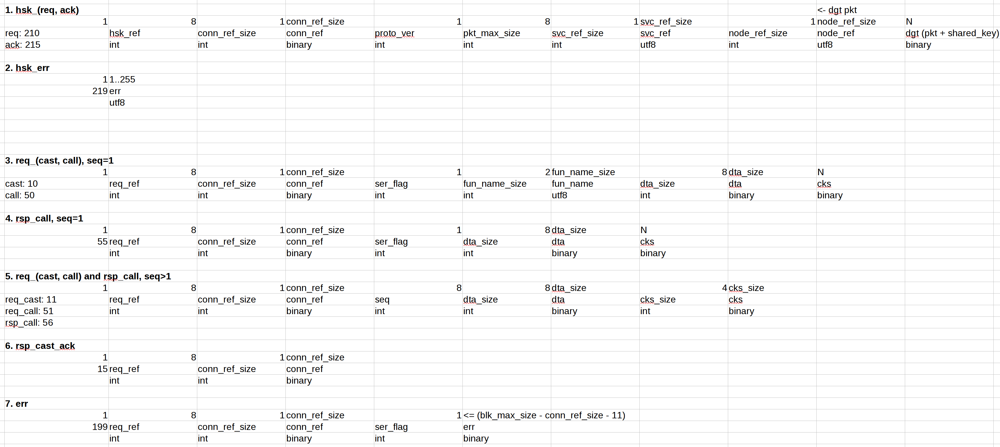

# MeshxRpc TCP protocol

`MeshxRpc` is build on top of custom binary TCP protocol:
  * two-step handshake,
  * ...

todo: Documentation will be provided at a later date.

Screenshot showing protocol messages overview:

